# Deploying Robotshop App with Atmosly 
 Welcome to the Atmosly deployment guide! This README will walk you through the steps to deploy Robotshop app on our platform.
 
Before we begin: 
1. [Here](https://docs-test.atmosly.com/docs/atmosly/what_is_atmosly) is a quick introduction of Atmosly.
2. [Here](https://docs-test.atmosly.com/docs/atmosly/before_you) is where you can learn about common terminologies that we will be using throughout this document.
Through this document, we will be deploying Robotshop application on Atmosly. [Listed here](https://docs-test.atmosly.com/docs/atmosly/deploy_your_first_application) is a brief of all the steps we will be following to successfully deploy the application. 
 
## About the Roboshop App
GitHub URL - https://github.com/atmosly/Roboshop-microservice-demo.git. 

This application consists of eight microservices -
 - Web
 - User
 - Ratings
 - Dispatch
 - Shipping
 - Cart
 - Catalogue
 - Payment

 ## Prerequisites
- An account on [Atmosly](https://app.atmosly.com/signup) 
Follow the steps here to sign up on Atmosly.
- A cloud account integrated   Follow the steps [here](https://docs-test.atmosly.com/docs/general/Integrations) to integrate your AWS account.
> PLEASE NOTE: we only have support of AWS on the platform right now.
- A cluster ready on Atmosly
Follow the steps [here](https://docs-test.atmosly.com/docs/clusters/create_cluster) to create a cluster on Atmosly.  
## Setup
We have an open source project available for the Robotshop App. 
### What are Projects:
Projects is an application blueprint on Atmosly where we define basic details for an application.  
Projects module have three elements:
1. Applicaton services
2. DataSource services
3. Environment Variables   

You can find more details about the Project module [here](https://docs-test.atmosly.com/docs/projects/create_project). 
### To make Robotshop App project on Atmosly: 
#### Step 1 : 
For the application services, you will need to click on the "+" icon in Applications and add microservice as per screenshot below. 
Adding Microservices:

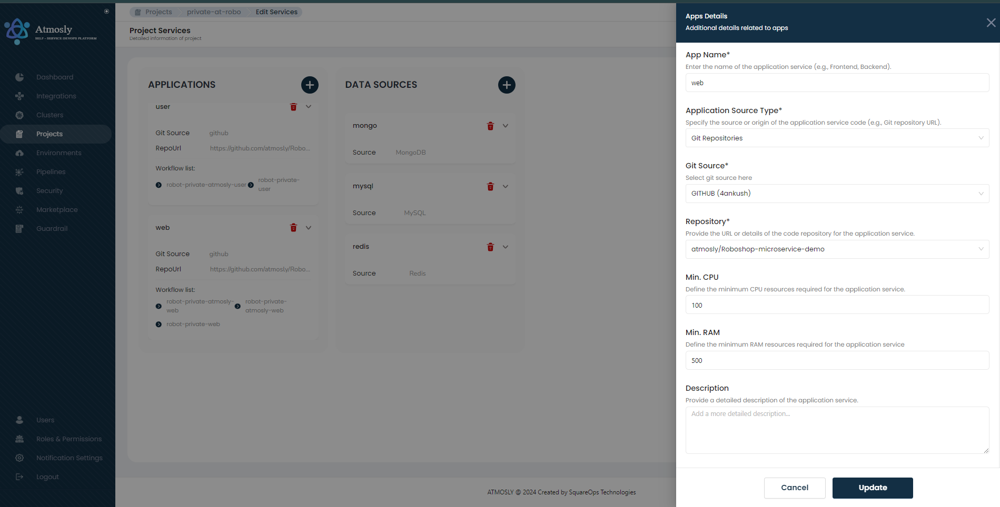

For all other application microservices,follow a similar structure as with the Web microservice. Repo would be considered service's repo. 
#### Step 2: 

For the database, you will need to click on the "+" icon in Data Sources and add PostgreSQL and Redis individually.  

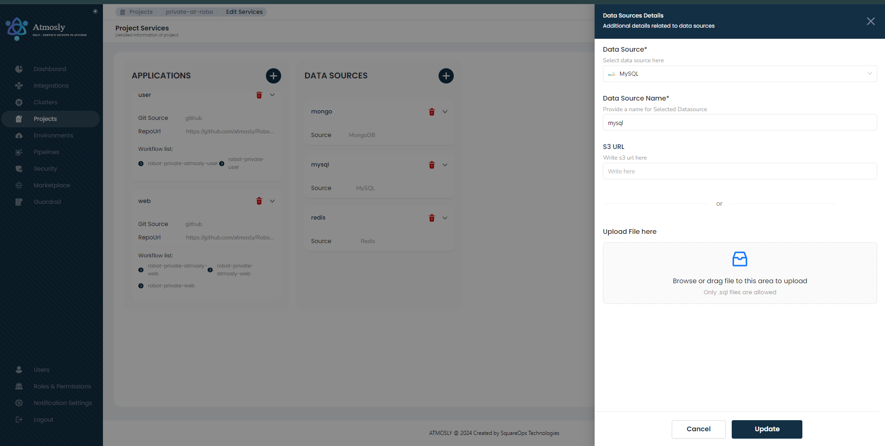  

Once you have added both application and datasource services, it would look like this:  

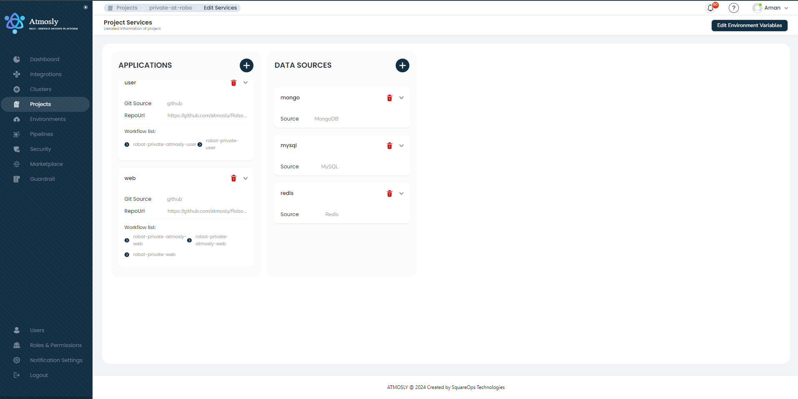

Now, to manage dependency in between applications, you can use environment variables to tell the, for example, Website Service where to find the Database Service. 
#### Step 3: 
a. Click on the **Edit Environment Variable** button. 

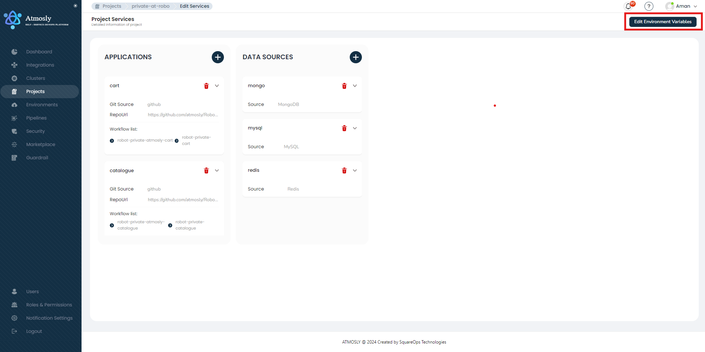  

You have two choices for adding environment variables:
1. Importing/ selecting the .env file from GitHub branch - by clicking on the **Import** button.
2. Manually adding it by clicking the **Add** button - in the case where you would like to manually define your variables or add to the list of environment variables, you can also add your variable manually. 

We will import our variables for the services: 
1. user microservice variables - Click on **Import** button and select 'main' as branch and select **atmosly-user_env_variables** as the file and click on **Proceed**.
2. shipping microservices variables - Click on **Import** button and select 'main' as branch and select **atmosly-shipping_env_variables** as the file and click on **Proceed**.
3. cart microservice variables - Click on **Import** button and select 'main' as branch and select **atmosly-cart_env_variables** as the file and click on **Proceed**.
4. payment microservice variables - Click on **Import** button and select 'main' as branch and select **atmosly-payment_env_variables** as the file and click on **Proceed**.
5. ratings microservice variables - Click on **Import** button and select 'main' as branch and select **atmosly-ratings_env_variables** as the file and click on **Proceed**.
6. dispatch microservice variables - Click on **Import** button and select 'main' as branch and select **atmosly-dispatch_env_variables** as the file and click on **Proceed**.
7. catalogue microservice variables - Click on **Import** button and select 'main' as branch and select **atmosly-catalogue_env_variables** as the file and click on **Proceed**.

The final screen after the environment variables have been added would look something like this - 

User: 

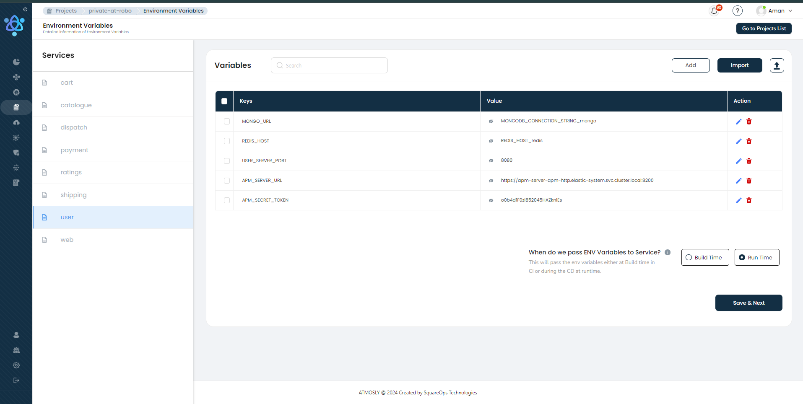 

Shipping: 

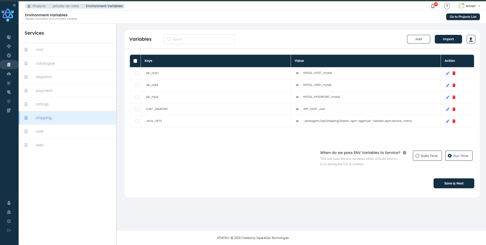 

Cart: 

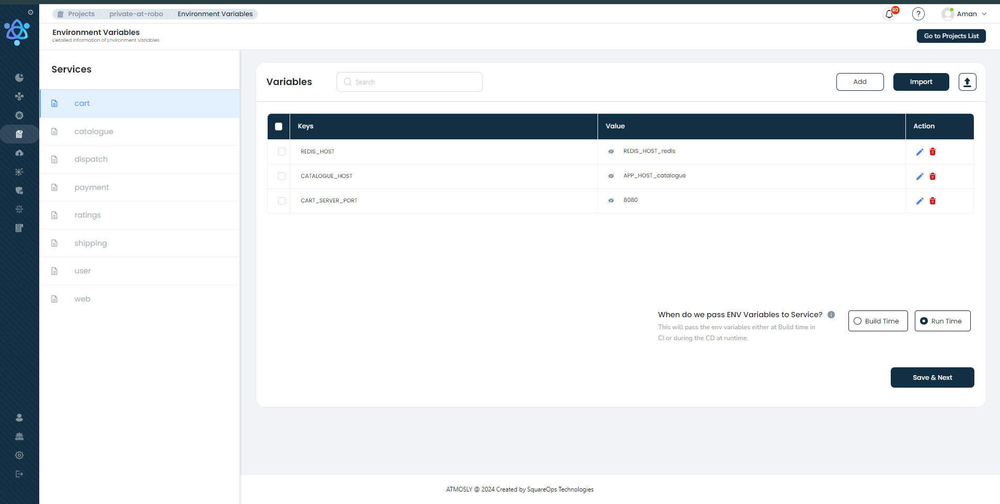 

Payment: 

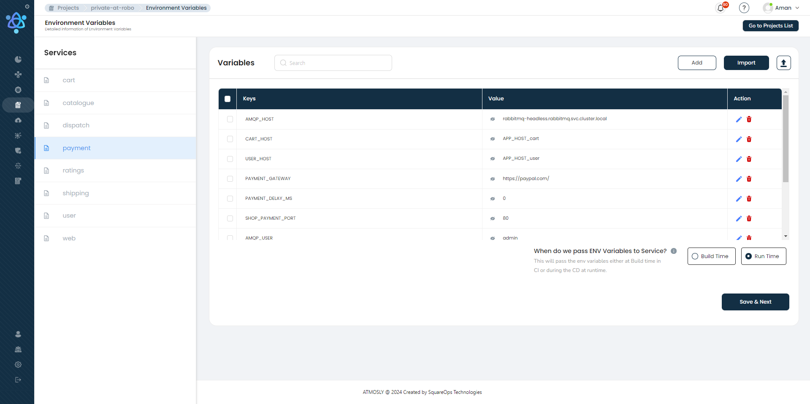 

Ratings: 

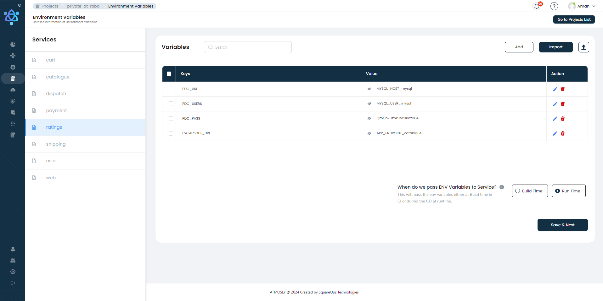 

Dispatch: 

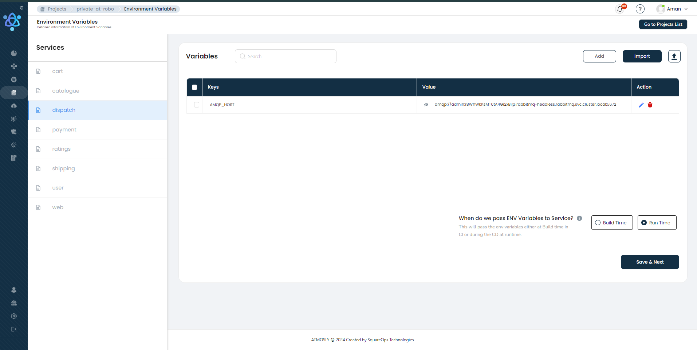 

Catalogue: 

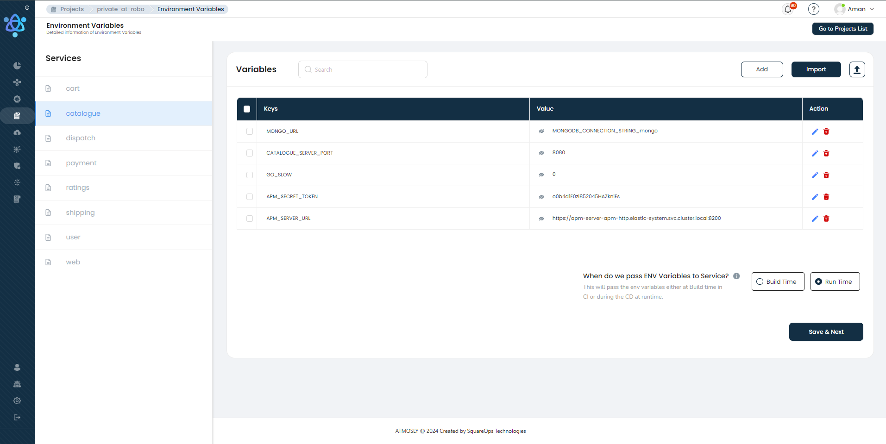 

Web: 

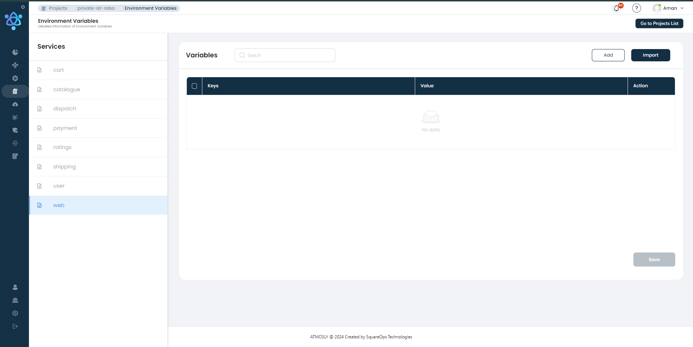 

Great! Our basic setup is completed. Now, let's create an environment for deploying the application on EKS cluster.
## Deployment
By this time you have: 
1. Successfully integrated a cloud account
2. Successfully created a cluster
3. Have a Robotshop App project

To create environment, follow the steps mentioned [here](https://docs.atmosly.com/docs/environments/create_env) with the information required.

### Application Services:

Please note, you will need to pass the following details to deploy Robotshop App - 
Robotshop app (All services branch)
1. Branch: 
    - Web: main
    - User: main
    - Ratings: main
    - Dispatch: main
    - Shipping: main
    - Cart: main
    - Catalogue: main
    - Payment: main
2. Dockerfile Path: 
    - Web: atmosly-web/Dockerfile
    - User: atmosly-user/Dockerfile
    - Ratings: atmosly-ratings/Dockerfile
    - Dispatch: atmosly-dispatch/Dockerfile
    - Shipping: atmosly-shipping/Dockerfile
    - Cart: atmosly-cart/Dockerfile
    - Catalogue: atmosly-catalogue/Dockerfile
    - Payment: atmosly-payment/Dockerfile
3. Build Context: 
 - Web: .
 - User: .
 - Ratings: .
 - Dispatch: .
 - Shipping: .
 - Cart: .
 - Catalogue: .
 - Payment: . 
3. port: 
 - Web: 8080
 - User: 8080
 - Ratings: 8080
 - Dispatch: 8080
 - Shipping: 8080
 - Cart: 8080
 - Catalogue: 8080
 - Payment: 8080
4. endpoint type:  
    - web: public load balancer
    - All services: ClusterIP
5. min-max CPU : 500m-1000m for all application services
6. min-max memory : 1000mi-2000mi for all application services

### Database Services:

Please note, you will need to pass the following details to deploy the database services for the Robotshop App (MySql , Mongo and Redis)

1. Type: 
    - Mongo: Self Managed
    - MySQL: Self Managed
    - Redis: Self Managed

2. Version: 
    - Mongo: any
    - MySQL: any
    - Redis: any

3. Nodegroup: 
    - Mongo: default
    - MySQL: default
    - Redis: default

4. Storage Size: 
    - Mongo: 5GB
    - MySQL: 5GB
    - Redis: 5GB

5. Username , Password & Dataname: 
    - Mongo: any
    - MySQL: any
    - Redis: any